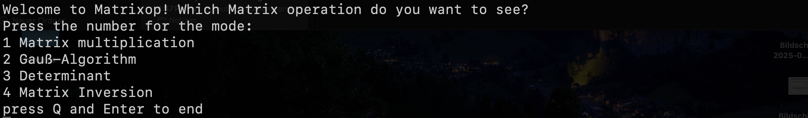

# Install Manual

1.Go to the directory where you want to install this program:

```
cd YOUR_DIRECTORY
```
2. Fork the repository in https://github.com/minseoowen9/Matrixop
3. Go to your Profile and you will see the copied repository.
4. Click on Code and copy the SSH clone (it will look something like git@github.com:YOUR_USERNAME/Matrixop.git)
5. clone the repository on the directory:

```
git clone git@github.com:YOUR_USERNAME/Matrixop.git
```

After done do:

```
cd matrixop
```
and then
```
make && ./matrixop
```
to compile and start the project.

if it looks like this:
<td>

</td>

then you're good to go!